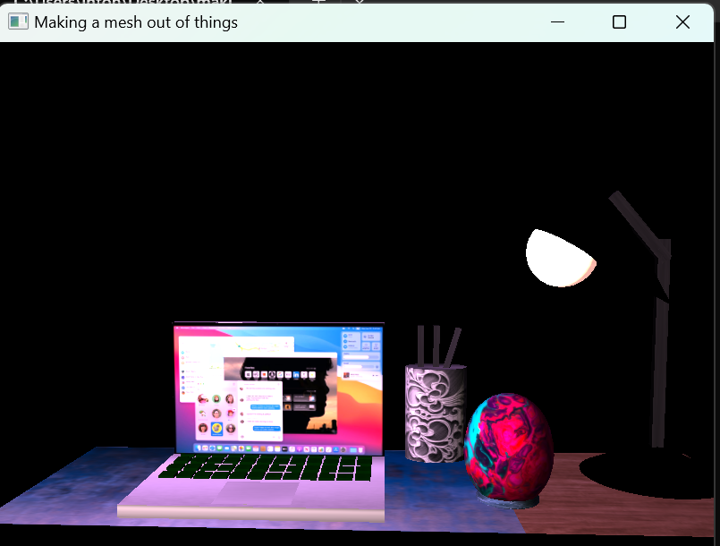

<h1>🛠️How do I approach designing software?</h1>

<strong>&nbsp;&nbsp;&nbsp;&nbsp;Q:</strong> What new design skills has your work on the project helped you to craft?

<strong>&nbsp;&nbsp;&nbsp;&nbsp;A:</strong> Reading documentation on libraries to better understand the concepts and googling parts that are not clear.

<strong>&nbsp;&nbsp;&nbsp;&nbsp;Q:</strong> What design process did you follow for your project work?

<strong>&nbsp;&nbsp;&nbsp;&nbsp;A:</strong> I used OOP and organization to keep code portable and reusable

<strong>&nbsp;&nbsp;&nbsp;&nbsp;Q:</strong> How could tactics from your design approach be applied in future work?

<strong>&nbsp;&nbsp;&nbsp;&nbsp;A:</strong> This has helped me understand more about creating graphics on a lower level

<h1>How do I approach developing programs?</h1>

<strong>&nbsp;&nbsp;&nbsp;&nbsp;Q:</strong> What new development strategies did you use while working on your 3D scene?

<strong>&nbsp;&nbsp;&nbsp;&nbsp;A:</strong> I look for things that every one who is enrolled in online school can relate to. After this, I looked at objects in my house and how they were put together. THe for example the laptop. it has a top case,a front panel, and a bottom case. In order for it to display right in a 3D space you need a shape for the screen, the top case, the bottom case, and the back panel. This helps with viewing the object from various angles

<strong>&nbsp;&nbsp;&nbsp;&nbsp;Q:</strong> How did iteration factor into your development?

<strong>&nbsp;&nbsp;&nbsp;&nbsp;A:</strong> Interating was a need for repetitive task such as loading textures and multiples of the same render can become tedious and cumbersome

<strong>&nbsp;&nbsp;&nbsp;&nbsp;Q:</strong> How has your approach to developing code evolved throughout the milestones, which led you to the project’s completion?

<strong>&nbsp;&nbsp;&nbsp;&nbsp;A:</strong>In opengl everything is referenced for performance. This has helped me understand pointers and memory allocation better and know when to access or free memory

<h1>How can computer science help me in reaching my goals?</h1>

<strong>&nbsp;&nbsp;&nbsp;&nbsp;Q:</strong> How do computational graphics and visualizations give you new knowledge and skills that can be applied in your future educational pathway?

<strong>&nbsp;&nbsp;&nbsp;&nbsp;A:</strong>These new skills help with creating debugging and testing of code to keep from hours of frustration looking for what went wrong. OpenGL doesn't have debugging out the gate and you have to configure for this so when something goes wrong you know where to look instead of a generic -1 code.

<strong>&nbsp;&nbsp;&nbsp;&nbsp;Q:</strong> How do computational graphics and visualizations give you new knowledge and skills that can be applied in your future professional pathway?

<strong>&nbsp;&nbsp;&nbsp;&nbsp;A:</strong> This helps with me get the edge on understanding how to find bugs in programming because a lot came and went while the development of my project

